# Evolution — come funziona, tutto

Un mondo che si costruisce da sé. Questo documento spiega ogni pezzo, con i diagrammi.

---

## 1. Il principio

Prima di scrivere qualunque riga, una domanda sola:

> *Sto descrivendo qualcosa che sarebbe vero anche se nessuno l'avesse mai pensato?*

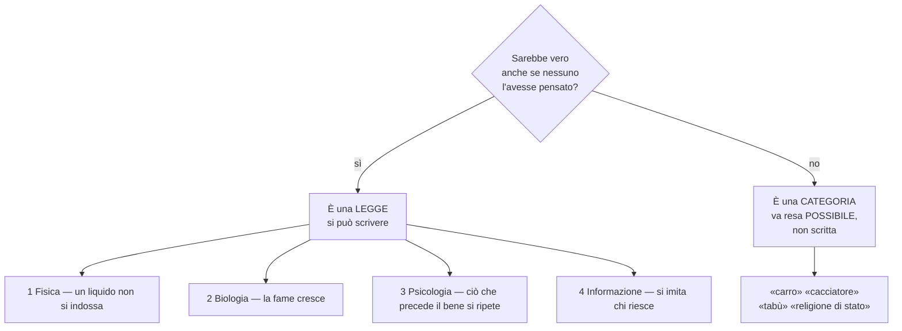

Ogni cosa che sembra scritta — i tabù, i mestieri, il lusso, i tiranni — **non lo è**: esce da
queste quattro famiglie di leggi.

---

## 2. Il battito

Un giro di simulazione. Il riquadro «⏱ Ritmo e prestazioni» misura quanto costa ciascun pezzo.

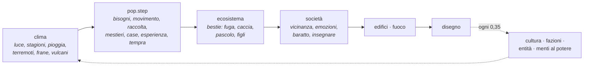

**A turni.** Quasi tutto il lavoro per-individuo è spezzato in fette: un terzo della gente per
battito col triplo del passo, un quarto delle bestie, un quarto della mappa. Per ciò che si accumula
è *identico* (è lineare nel tempo); per ciò che capita a caso la probabilità moltiplicata tiene lo
stesso ritmo medio.

**Ma c'è un terzo caso, e qui c'era scritto che non esistesse: la REATTIVITÀ.** Accumulare e tirare
dadi si spezzettano senza danno; *accorgersi in tempo* no. Una bestia che tocca un turno su quattro
si accorge del predatore fino a tre battiti dopo, e tre battiti sono la differenza fra scappare e
essere presa.

> **Misurato, e non è un dettaglio.** A 1 500 persone, portando le bestie da quattro turni a due,
> nello stesso mondo e con lo stesso seme: la fauna passa da **27 659 a 35 397 capi** (+28%) e i
> predatori da **1 434 a 2 542** (+77%). Con quattro turni il mondo è *più duro* di quanto dovrebbe.
>
> **E poi la stessa misura su un mondo grande ha ribaltato la decisione.** A 3 000 persone:
>
> | turni | bestie | predatori | passo bestie | giro intero |
> |---|---|---|---|---|
> | **4** | 23 080 | 5 366 | **74 ms** | **303 ms** |
> | 2 | 25 994 | 9 507 | 324 ms | 548 ms |
> | 1 | 32 792 | 8 755 | 1 341 ms | 1 787 ms |
>
> Il prezzo sale e il guadagno scende: a 1 500 persone due turni costavano ×1,5 per +28% di fauna,
> a 3 000 costano **×1,8 sull'intero battito** per +13%. Avevo messo il default a 2 sulla misura del
> mondo piccolo; **con quella del mondo grande è tornato a 4**. Non è un ripensamento: è la stessa
> regola — misurare prima di decidere — applicata a una misura migliore.
>
> Resta una manopola nel pannello (*«A quanti turni vanno le bestie»*), con dentro i numeri: su un
> mondo piccolo il prezzo è basso e la fedeltà si può comprare.

---

## 3. Il mondo e la materia

### 3.1 Dove si trova una cosa — geologia dedotta

Nessun elenco di nomi: dove una sostanza si trova dipende da **come si è formata**, e quello si
legge nelle sue proprietà.

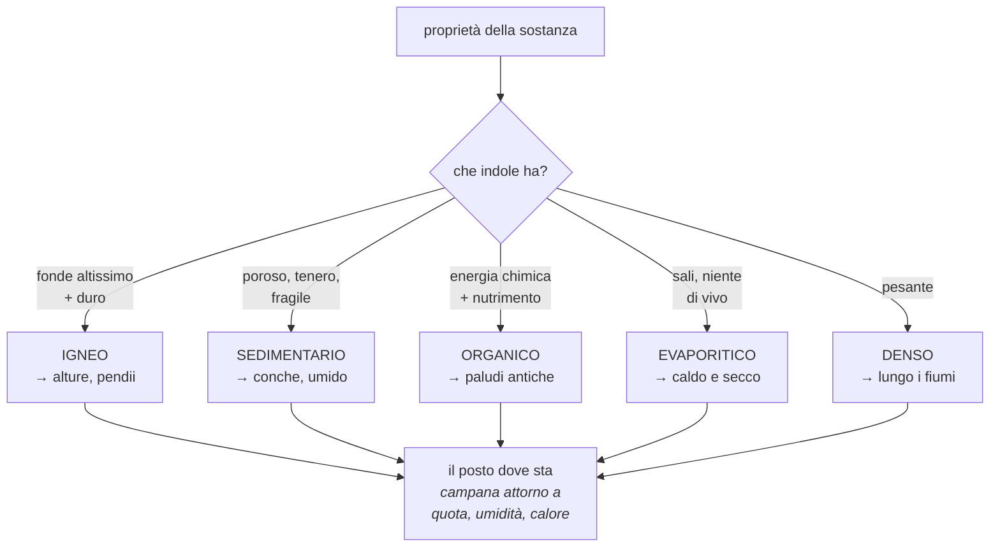

> **Verificato:** in alto Quarzo 0,64 · Ferro 0,55 · Oro 0,51; in basso Petrolio 0,19 · Carbone
> 0,27; il Salnitro dove fa caldo (0,76); lungo i fiumi Marmo 0,63. *L'oro si cerca nei fiumi
> perché è denso, e nessuno l'ha scritto.*

I **viventi** hanno invece una nicchia climatica (`caldoIdeale`, `acquaIdeale`, `adattabilita`):
l'aloe sta nel caldo secco, la belladonna nell'umido fresco. Da qui le flore regionali e le cucine
diverse fra popoli.

### 3.2 Gli stati della materia — `matter.js`

Questo file è hardcodato **apposta**: è fisica.

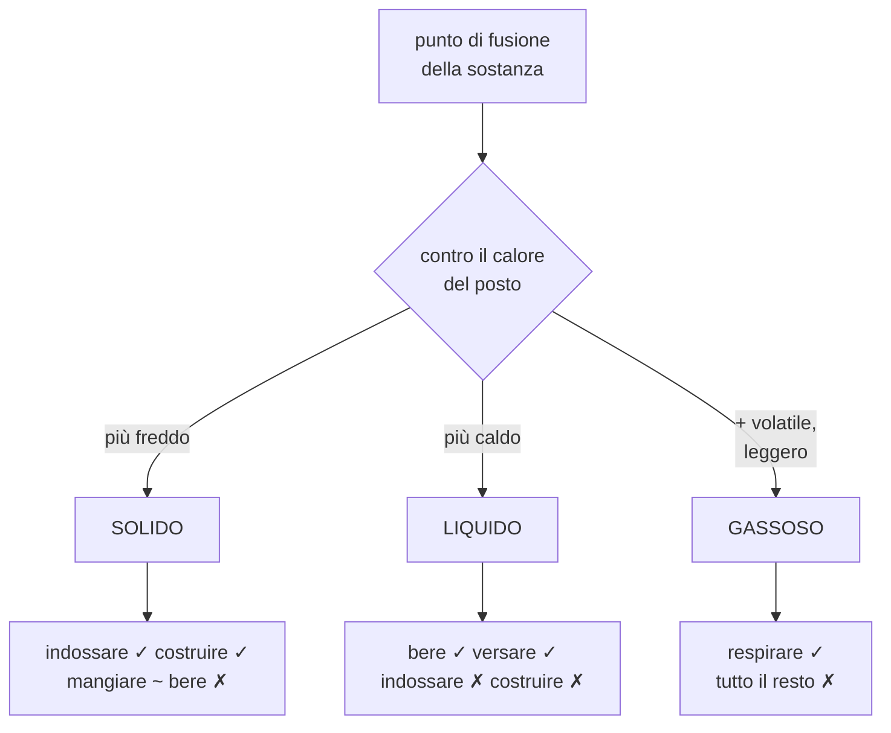

Lo stato dipende dal **posto**: il mercurio gela in montagna, il miele e il grasso colano nel
deserto. E la tavola dice cosa è *possibile*, mai cosa è *buono*: il legno si può mangiare — è solo
pessimo, e infatti nessuno lo fa finché non è disperato.

### 3.2.1 Il recipiente

Un liquido nell'inventario si comportava come un sasso: restava lì. Ma **l'acqua non si porta nelle
mani**, e finché non la si perdeva nessuno aveva un motivo per inventarsi un vaso.

Adesso un liquido senza niente che lo tenga si versa per strada. E il recipiente non è una
categoria dichiarata: è la risposta a tre domande di fisica.

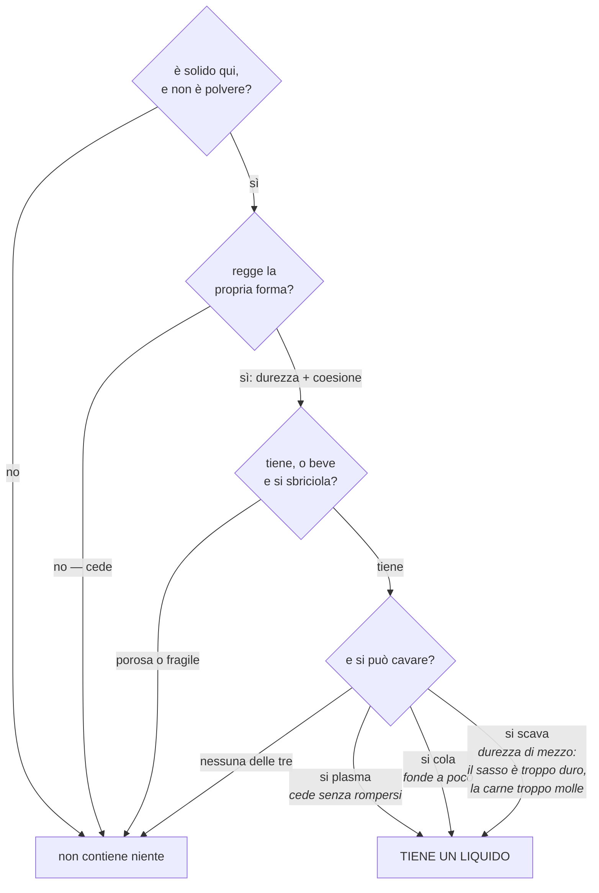

> **Misurato su 46 materie, senza dichiararne nessuna:** tengono un liquido **Stagno 0,98 · Bambù
> 0,90 · Rame 0,89 · Argilla 0,74 · Pelle 0,69 · Piombo 0,64 · Legno 0,62 · Corno 0,60 · Osso
> 0,56**. Fuori restano grano, carne, sale, sabbia — e il diamante e l'ossidiana, troppo duri e
> troppo fragili per essere svuotati.
>
> La prima versione della formula era sbagliata e la misura l'ha detto subito: dava **Grano 0,96 e
> Ferro 0,07**, perché guardava solo se una cosa fosse *facile da scavare* e il grano è tenerissimo.
> Mancava la condizione più ovvia — un recipiente deve **stare in piedi**.

Nella stessa misura è venuto fuori un altro fatto: **`porosita` è a zero su tutte le materie di
partenza.** La proprietà esiste da sempre e non l'ha mai impostata nessuno; resta nel conto perché
le cose fabbricate la ereditano dalle miscele, ma sulle materie grezze non dice niente.

### 3.3 Il paesaggio si muove

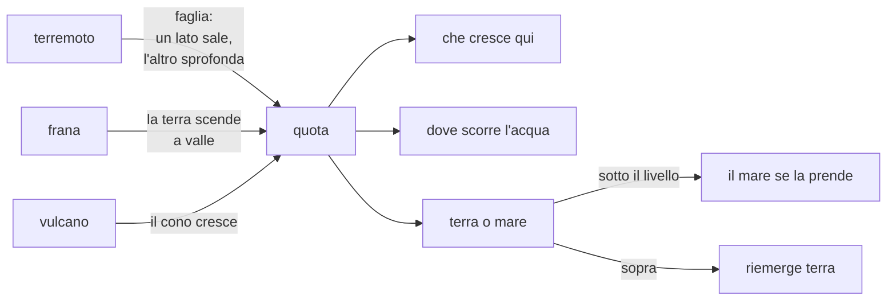

Quando un tile passa il livello del mare **diventa un'altra cosa**, e quale lo dicono il clima e
la quota di adesso — non la memoria di com'era. Prima si ripristinava il bioma originario: un
fondale che riemergeva tornava «mare», cioè terra asciutta che nessuno poteva calpestare né
coltivare. E il mare **resta salato sempre**: se il mare si prende un fiume o un acquitrino, quel
posto smette di essere acqua da bere nello stesso istante.

> **Verificato in 664 anni:** il 26,6% della mappa ha cambiato quota, 80 tile hanno cambiato natura,
> **248 volte** un pezzo di terra è emerso o affondato. Le coste cambiano davvero.
>
> **E dopo 166 ribaltamenti terra↔mare, il conto torna esatto:** 0 tile di mare che si potrebbe
> bere, 0 tile di terra asciutta marcati come mare, 0 fondali marcati come terra.

---

### 3.4 Il branco, e il prezzo di starci

`socialita` era un gene come tutti gli altri: si ereditava, mutava a ogni generazione — e **non
faceva assolutamente niente**. Un gene senza conseguenze non si può selezionare: derivava a caso.

Adesso ha un premio e un prezzo, e sono in tensione fra loro.

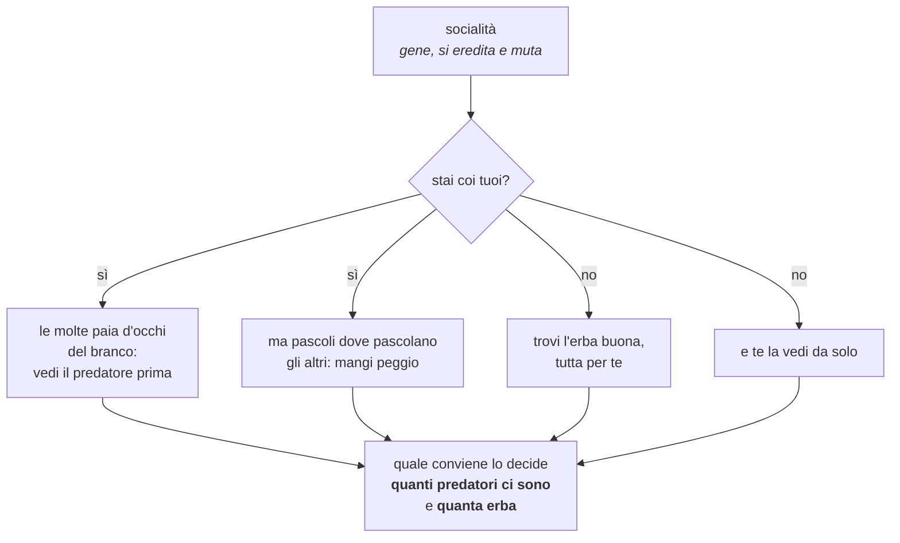

Il punto non è che i gregari vincano: è che **adesso c'è una gara**. Dove i predatori abbondano
converrà stringersi, dove scarseggiano converrà sparpagliarsi, e non l'ha deciso nessuno.

> **Misurato in un mondo rado (1 894 bestie):** un solitario sta il **18% più lontano** dal suo
> vicino più stretto — 3,15 contro 2,67. A 3 386 bestie il divario scende al 6%; a 21 000 sparisce.
>
> Ed è giusto così, non è un difetto: **in un mondo saturo nessuno *può* stare solo.** La prima
> versione faceva stringere il branco solo agli animali sazi, e non si vedeva niente (4,32 contro
> 4,34): ovvio col senno di poi, perché quasi nessuno è mai sazio e il pascolo governa tutto il
> movimento. È lì che si decide se un branco esiste.

---

## 4. Una persona

### 4.1 Il ciclo di una vita

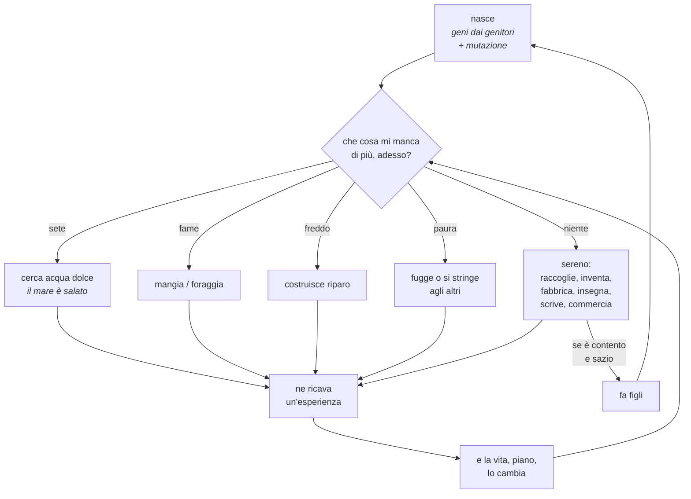

### 4.2 Come sceglie — `desire.js`

**Una sola funzione** decide tutto: cosa mangiare, cosa raccogliere, con cosa costruire, cosa
barattare. I vizi capitali non sono comportamenti a parte: sono i **pesi** della stessa somma.

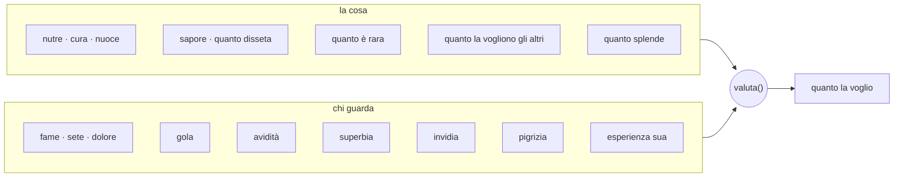

- **Gola** → cerca il sapore *anche da sazio*: è la prima cosa che si desidera senza che serva.
- **Avidità** → le cose valgono in sé → accumulo → disuguaglianza.
- **Superbia** → vuole ciò che gli altri non hanno.
- **Invidia** → vuole ciò che vogliono gli altri: da qui la moda.
- **Pigrizia** → sconta la fatica: il pigro mangia peggio.

### 4.2.1 Riempirsi non è nutrirsi

Qui c'era un numero fisso: qualunque cosa passasse il filtro del commestibile toglieva quasi la
stessa fame, e il nutrimento contava poco. Da lì veniva la segatura mangiata volentieri — e, peggio,
brucare scarti toglieva *più* fame che mangiare un cibo mediocre: conveniva non riconoscere niente.

Ma sono due cose diverse, e il motore le misurava già tutt'e due.

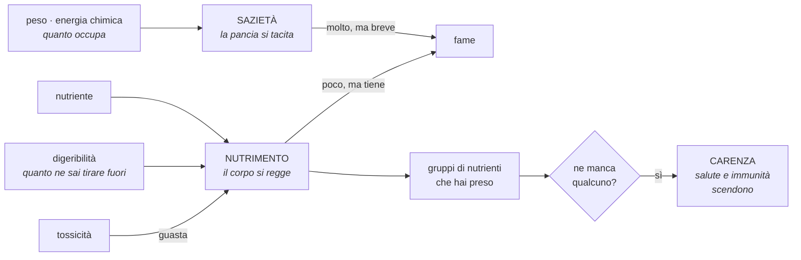

Così la segatura riempie e non nutre, e chi campa di roba che riempie e non nutre **lo paga con la
carenza** — che è la stessa legge per cui mangiare sempre la stessa cosa costa qualcosa anche
quando la fame è a posto.

> **Misurato**, stesso seme, all'anno 165: **14 458 persone contro 9 724** — un terzo in meno, con
> la fame appena più alta (0,36 → 0,39) e salute e fertilità *identiche* (0,79 e 0,84). Un terzo di
> gente in meno che sta esattamente altrettanto bene: prima il mondo reggeva quella folla soltanto
> perché la roba senza valore nutriva quanto il grano. *(La stessa misura porta dentro anche
> l'usura delle case: le due cose sono state accese insieme.)*

### 4.3 Come impara — `experience.js`

Una legge sola, e **si impara dalla sorpresa**, non dal bene assoluto.

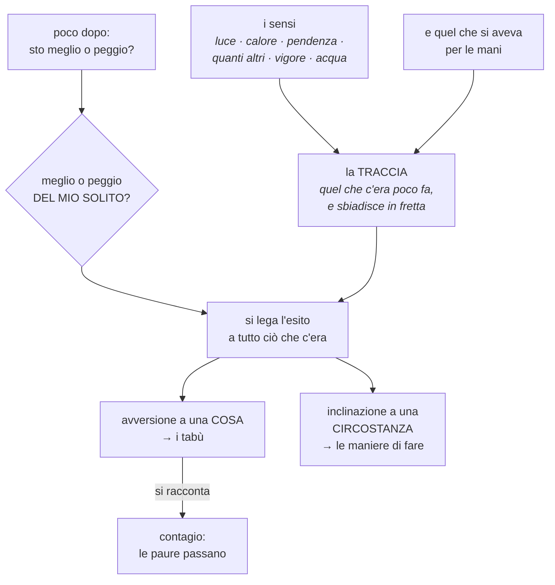

**La stessa legge** produce il tabù e la «dottrina militare»: è la stessa cosa vista una volta su un
oggetto e una volta su una circostanza. E **può sbagliare** — se non potesse, non sarebbe
apprendimento: in ogni mondo nascono due o tre superstizioni su cose innocue.

> Senza la centratura sulla *sorpresa* il meccanismo si rompeva in silenzio: siccome essere vivi va
> quasi sempre bene, ogni cosa risultava buona e nessuna si distingueva.

Queste due cose — le maniere di fare e i tabù — erano calcolate da sempre e **non si vedevano da
nessuna parte**: due funzioni scritte, esportate e mai chiamate. Adesso stanno nel riquadro
«Società e sentimenti», accanto ai memi e alle fedi, che è la loro famiglia.

Tirarle fuori ha voluto dire riparare due soglie che erano numeri decisi da me, e che dopo il
passaggio all'apprendimento per sorpresa non stavano più in piedi:

- la piega di un popolo veniva letta **in assoluto**, e usciva un popolo che «si trova male in
  piena luce *e* nel buio» — che non vuol dire niente. Ma le perdite sono brusche e i guadagni
  graduali: la media di qualunque cosa pende un po' in basso. Quello che dice qualcosa di un
  popolo non è quanto sta male, è **dove sta meno peggio che altrove**;
- un tabù chiedeva che a rifiutare una materia fosse **il 12% del mondo intero** — con settemila
  persone, ottocentosessanta sulla stessa identica cosa. Non usciva mai niente. Ma un tabù non è
  una cosa del mondo: è una cosa di chi quella materia l'ha avuta per le mani. E la soglia se la
  dà il mondo, non io: c'è un tasso di fondo con cui *qualsiasi* cosa va male a qualcuno, e è
  tabù ciò che viene evitato molto più di quello.

> **Osservato in un mondo di 7 966 persone:** si trovano meglio *in piano ↑ · sui pendii ↑*, peggio
> *in piena luce ↓ · all'asciutto ↓*. E le cose che evitano sono **Tabacco 39% · Cotone 39% · Legno
> 35% · Argilla 33% · Canapa 33% · Lino 33%** (sulla gente che le conosce, contro un fondo del 22%).
>
> Sono tutte cose fibrose che si raccolgono e non nutrono. Nessuno ha scritto che il legno non si
> mangia: l'hanno imparato, e adesso lo scansano.
>
> **E in un mondo lasciato correre fino all'anno 168, la classifica diventa questa:**
> **Belladonna 65% · Papavero 42% · Cotone 40% · Zolfo 38% · Bambù 37% · Legno 36%.**
>
> In cima ci sono i veleni veri, e la belladonna stacca tutto il resto di venti punti. Nessuna riga
> del motore dice che la belladonna è velenosa — c'è scritto che ha tossicità alta, e il corpo di
> chi la mangia ne risente. Il resto — che quel dolore diventi un'avversione, che l'avversione si
> racconti, che dopo un secolo sia la cosa più scansata del mondo — non l'ha scritto nessuno.

### 4.4 Come cambia — `tempra.js`

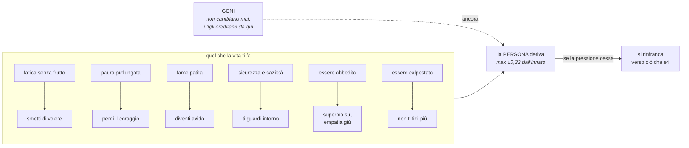

**Non è Lamarck**: i geni restano, deriva la persona, e i figli ricominciano.

E qui nasce una cosa che nessuno ha scritto: l'archetipo di un capo si **legge dai suoi tratti**
(`dittatore` pesa `−empatia`, `riformatore` pesa `+empatia`), quindi chi comanda a lungo diventa il
tipo di persona che reprime.

> **Misurato**, stesso mondo con e senza: capi «duri» 92% contro 75%; empatia dei capi −0,033,
> superbia +0,041. L'effetto è reale ma modesto.

### 4.5 Quanto è bravo — `skill.js`

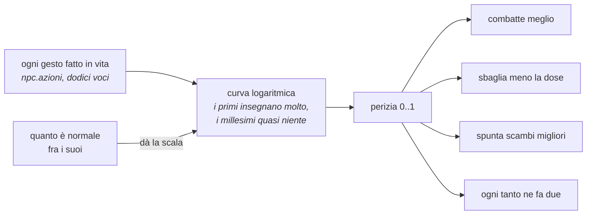

**Non è l'età**: un vecchio che non ha mai impugnato niente non sa combattere. E la scala se la dà
il mondo: in un mondo in pace sette scontri fanno un maestro.

> **Misurato:** una vita di mestiere vale fino a **×1,6 per colpo**, ma satura (insuperato-3000
> contro insuperato-1000: solo ×1,06).

---

### 4.5.1 Saper fare un'ascia non è avere un'ascia

La qualità dell'utensile di una persona veniva da quello che **sapeva fabbricare**. Bastava
conoscere la ricetta e i metalli si estraevano per sempre, senza che niente si consumasse mai: il
sapere era una porta che si apriva e restava aperta.

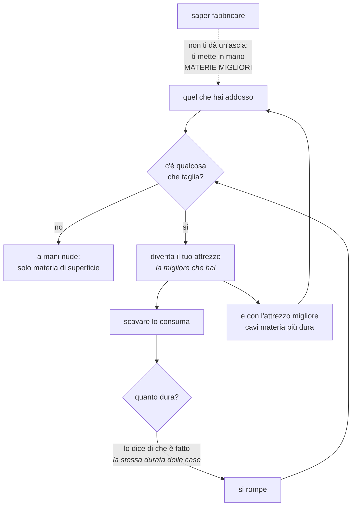

**Nessun tetto sul sapere** — e qui la misura mi ha corretto due volte. Prima avevo limitato
l'attrezzo a ciò che uno sa fabbricare, e veniva fuori il contrario di quel che volevo: chi non
aveva ancora un mestiere si ritrovava *senza* limite. Ma soprattutto era sbagliato in sé:
**raccogliere una selce tagliente e usarla non richiede nessuna ricetta.** Il sapere entra da
un'altra porta, ed è quella giusta — sapere fabbricare ti mette in mano materie migliori, e quelle
diventano attrezzi migliori da sé.

> **Misurato a 132 anni:** 4 588 attrezzi forgiati e 2 035 rotti; 1 915 persone su 5 118 ne hanno
> uno in mano. Se li fanno di **Rame, Osso, Selce, Pietra, Corno, Ossidiana** — e nessuna di queste
> è dichiarata «materiale da utensili» da nessuna parte: sono semplicemente le cose che tagliano.
>
> L'era dei metalli **si raggiunge lo stesso**, che era il rischio vero della modifica. Ma il Ferro
> resta raro (84 pezzi in tutto il mondo) e il Diamante rarissimo (5). Fra le materie da attrezzo
> compare anche «**Selqua forgiato**» — una materia che si sono inventati loro, con un nome che
> nessuno ha scritto.
>
> La prima taratura era troppo permissiva e la misura l'ha detto subito: la gente si faceva utensili
> di **gesso e di sabbia**. Un attrezzo serve perché taglia, e solo in seconda battuta perché è duro.

### 4.6 Quello che si costruisce torna polvere

Una casa, alzata una volta, restava in piedi per sempre: solo un terremoto o una guerra potevano
portarla via. Ma niente resta — la pioggia entra, il gelo spacca, il sole cuoce.

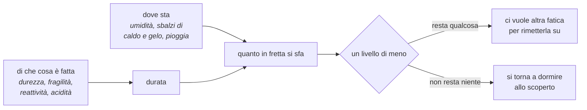

Non è manutenzione: è il pezzo che mancava perché **la ricchezza costi**. Prima chi si era fatto
una casa una volta era a posto per la vita, e la disuguaglianza si accumulava e basta. Adesso la
pietra dura e la paglia no, tenere una casa grande costa fatica ogni anno, e chi smette di curarla
la perde. Da qui vengono le rovine — e il cimelio, che è la cosa fatta così bene da durare più di
chi l'ha fatta.

---

## 5. Il gruppo

### 5.1 Come nasce un popolo

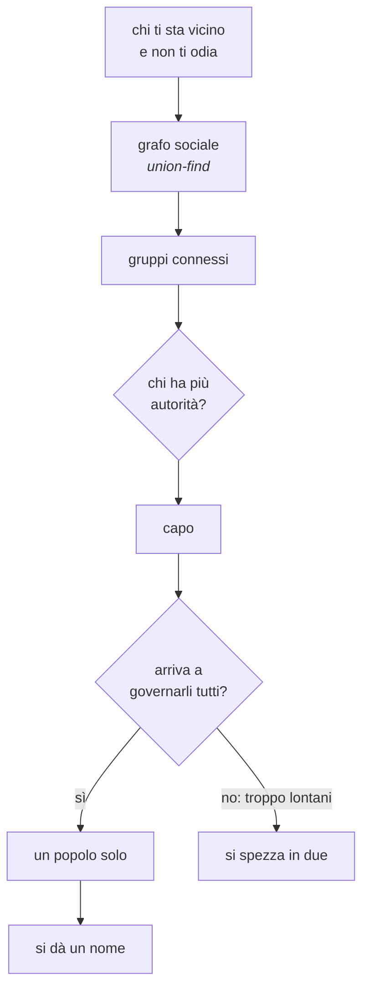

Nessun livello amministrativo è scritto: villaggio, città e regno sono **come li chiamiamo noi**
guardando quanto è grande il grafo.

### 5.2 Le coorti — `coorti.js`

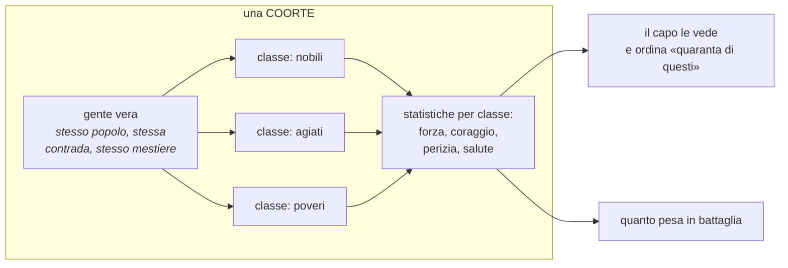

**È uno sguardo, non una sostituzione**: gli individui restano tutti. Le classi servono a conservare
le *correlazioni* fra attributi — una media sola perderebbe che «i forti erano gli esperti».

### 5.3 L'economia

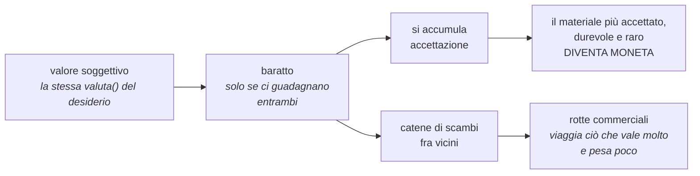

> **Verificato:** l'argento si cava dove la temperatura è 0,247 e si ritrova in mano alla gente a
> 0,702 — uno spostamento di 0,455. Nessun mercante è programmato.

### 5.4 Il lusso — come nasce dal niente

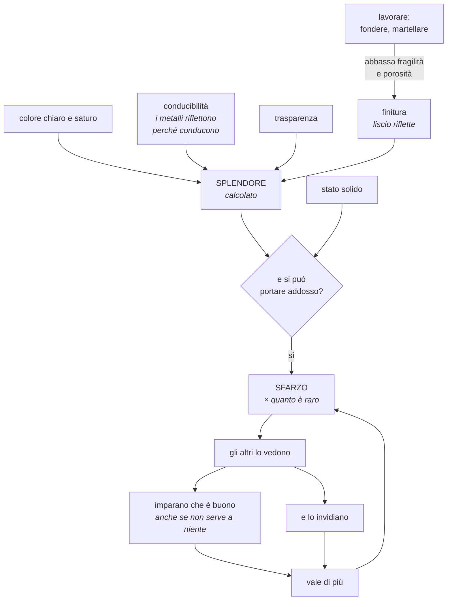

> **Verificato:** oro e argento diventano le cose più amate del mondo, sopra il grano — e non
> nutrono, non curano, non tagliano. Correlazione fra sfarzo e ceto: **0,88**. E l'oro *fuso*
> splende il 6% più dell'oro grezzo, il ferro il 18%, perché lavorare liscia.

---

### 5.5 Si imita chi riesce — ma non uno per volta

`entities.js` è il meta-livello: gli NPC inventano usanze che il motore non conosce, con nomi che si
danno da soli. La legge che le diffonde era dichiarata da sempre — *si imita chi ha successo* — e non
poteva funzionare, per lo stesso difetto del contagio e nascosto nello stesso `break`: **per quanti la
praticassero e per quanta gente ci fosse intorno, ogni tiro convertiva una persona sola.**

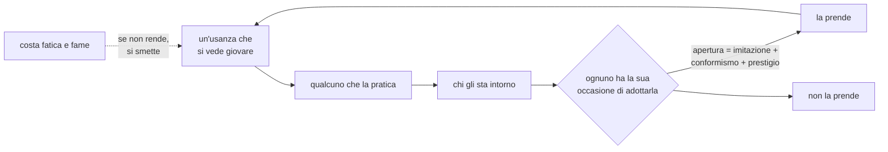

> **Misurato, e la prima taratura era inutile.** Avevo reso la diffusione proporzionale alla folla e
> poi scelto un coefficiente (0,09) che con una ventina di vicini dava *esattamente* il risultato di
> prima: la più diffusa all'**1,6%** del mondo contro l'1,7%. Il collo vero non era la probabilità
> per persona — era che il tiro scatta poche decine di volte in un secolo, quindi un'usanza non poteva
> superare ~50 praticanti comunque.
>
> Con la taratura giusta (0,22), a 87 anni su 2 862 persone: la più diffusa arriva a **191 praticanti,
> il 6,7% del mondo**, e il 7,7% ne pratica almeno una. Ma la cosa che conta è la *forma*: **quella che
> si diffonde è quella che giova di più** (0,616), con una coda lunga di usanze marginali. Prima erano
> tutte ugualmente minuscole — e dove tutto è uguale la selezione non ha su cosa mordere.

---

## 6. Il potere

```mermaid
flowchart TD
    subgraph SA["quel che il capo SA"]
        S1["il suo popolo:<br/>fame, salute, malcontento"]
        S2["le sue schiere<br/><i>coorti con perizia e ceti</i>"]
        S3["che cosa possiede"]
        S4["le terre che gli<br/>esploratori hanno visto"]
        S5["i vicini — e cosa dicono<br/><i>menzogne comprese</i>"]
        S6["com'è andata<br/>l'ultima volta"]
    end
    SA --> LLM["un LLM impersona il capo<br/><i>indole dai suoi tratti veri</i>"]
    LLM --> ED["editti:<br/>tipo · quanti · dove"]
    ED --> OB{"obbedienza<br/><i>lealtà, paura, conformismo,<br/>distanza, malcontento</i>"}
    OB -->|"sì"| FA["lo fa"]
    OB -->|"no"| IG["lo ignora<br/><i>e il consenso si logora</i>"]
    FA & IG --> RA["rapporto:<br/>che fine ha fatto<br/>ogni ordine"]
    RA --> SA
```

**Gli ordini sono influenza, non comandi**: i bisogni vitali vincono sempre.

### 6.1 Le parole che il mondo non conosce

Qui c'era scritto che non esisteva una lista bianca. Non era vero: `validaEditti` scartava in
silenzio ogni ordine fuori dai quattordici noti, e il rapporto diceva al capo che erano stati
eseguiti. Era libertà a parole.

Ora passa **qualunque parola**. Ma nessuno la spiega a nessuno — succede quello che succede
davvero quando ti arriva un ordine che non capisci: fai la cosa che ti sembra più sensata, e da
quella la parola prende senso.

```mermaid
flowchart TD
    P["il capo dice una parola<br/>che il mondo non conosce"] --> Q{"i suoi le hanno<br/>già dato un senso?"}
    Q -->|"sì, e ha retto"| USA["fa quel che vuol dire<br/>fra i suoi"]
    Q -->|"no, o si sta sfaldando"| IND["ognuno la intende<br/>a modo proprio"]
    IND --> C1{"nomina una cosa<br/>che conosce?"}
    C1 -->|sì| G1["procurarla"]
    C1 -->|no| C2{"nomina un altro<br/>popolo?"}
    C2 -->|"e lo detesta"| G2["andargli addosso"]
    C2 -->|"e non lo detesta"| G3["andare a trattare"]
    C2 -->|no| C3{"indica un posto<br/>lontano?"}
    C3 -->|sì| G4["andarci"]
    C3 -->|no| C4["<b>la circostanza</b><br/>estranei intorno · paura ·<br/>fame · nessun tetto ·<br/>malumore · speranza"]
    C4 --> G5["il gesto che quella<br/>situazione richiede"]
    C4 -->|"niente preme"| G6["il proprio mestiere"]
    G1 & G2 & G3 & G4 & G5 & G6 --> VOTO["il suo voto"]
    VOTO --> MAG["fra i primi otto che la sentono<br/>vince quella intesa da più gente"]
    MAG --> ESITO{"chi l'ha obbedita<br/>sta meglio di prima?"}
    ESITO -->|sì| RAD["la parola si radica"]
    ESITO -->|no| SFA["si sfalda, e qualcuno<br/>ricomincia a interpretarla"]
    RAD & SFA --> REP["il capo lo legge nel rapporto:<br/><i>che cosa è diventata ogni sua parola</i>"]
```

Tre cose ne vengono, e nessuna è scritta:

- **popoli diversi danno alla stessa parola sensi diversi** — sono dialetti, e nascono perché
  stanno vivendo cose diverse quando la sentono;
- **il senso non lo fissa un uomo, lo fissa la maggioranza** — i primi otto che la sentono votano
  con quello che capiscono, e da lì è lingua;
- **una parola che porta male si sfalda** e torna interpretabile: le lingue cambiano perché
  cambia quello che le parole fanno succedere.

Il motore non sa che cosa voglia dire «censura». Sa quali gesti ha un corpo, e sceglie fra quelli
guardando quello che chi ascolta ha davanti agli occhi.

> **Osservato in gioco:** `attaccare×120, raccogliere×80, coltivare×60` — 120 persone all'attacco.
> In un secolo: 114 editti, 22 menzogne, 38 repressioni, 53 elargizioni, un generale nominato.

> **Misurato** mettendo in bocca ai capi sei parole che il motore non conosce — *fortificare,
> silenzio, censura, tributo, legge marziale, vendetta*. Prima venivano scartate tutte in silenzio;
> in centoventitré anni ne sono stati **presi in carico 29 912 ordini**, sono nati **257
> significati** presso ventidue popoli, e **78** sono cambiati strada facendo prima di assestarsi.
>
> Non attecchisce tutto, ed è il punto: **84 radicate, 161 ancora incerte, 12 sfaldate.** È da
> questa distribuzione che un capo capisce quali sue parole hanno fatto presa.
>
> E ogni popolo intende a modo suo: «censura» → *difendere* (78%), «tributo» → *attaccare* (59%),
> «legge marziale» → *attaccare* (44%) o *esplorare* (37%). Nessuno ha scritto nessuno di questi
> significati: li ha decisi la situazione in cui quei popoli si trovavano quando l'hanno sentita.

### 6.2 I delegati

Un capo si sente fino a dove arriva la sua voce, e non oltre. Non serviva nessuna gerarchia per
avere i governatori: bastava che l'obbedienza si misurasse sulla **voce più vicina** fra il capo e
i suoi nominati, invece che sempre e solo sul capo.

```mermaid
flowchart LR
    C["il capo"] -->|"a novanta passi<br/>non ti sente nessuno"| L["la periferia"]
    C -->|nomina| D["un delegato<br/><i>generale, sacerdote,<br/>maestro, mercante</i>"]
    D -->|"sta lì, in mezzo a loro"| L
    L --> O{"a chi obbedisci?"}
    O -->|"a chi senti più vicino"| E["si fa"]
    D -.->|"ma la sua voce vale meno:<br/>0,55 + il potere che ha messo insieme"| O
    D --> R["e intanto accumula potere…"]
    R -.->|"un delegato lontano<br/>e molto ascoltato"| U["…è la stoffa di<br/>cui è fatto un usurpatore"]
```

> **Misurato** su un popolo di 170: chi sta a 45 passi dal capo passa da **0,581 a 0,760** di
> obbedienza quando il capo mette qualcuno in mezzo a loro. Chi gli sta addosso (3,5 passi) resta a
> 0,965 — il controllo dice che non è cambiato niente per loro, come dev'essere.

### 6.3 Anche le cariche si possono inventare

Era rimasta un'ultima lista chiusa, della stessa forma di quella caduta per gli editti: un capo
poteva nominare quattro cose — *generale, sacerdote, maestro, mercante* — e ogni altra parola
veniva scartata in silenzio.

Adesso passa qualunque carica, e non è servito nessun meccanismo nuovo: un ruolo inventato funziona
attraverso quello dei **delegati**, che c'era già. Il nome se lo tiene il capo.

```mermaid
flowchart TD
    N["il capo nomina<br/>una carica"] --> C{"il mondo la conosce?"}
    C -->|"sì: generale, sacerdote,<br/>maestro, mercante"| A1["si sceglie chi è<br/>più tagliato per quella"]
    C -->|"no: se l'è inventata"| A2["si sceglie chi già<br/><b>spicca fra i suoi</b><br/><i>— è quel che si fa davvero<br/>creando una carica nuova</i>"]
    A1 & A2 --> D["porta la voce del capo<br/>dove lui non arriva"]
    D --> U{"a che serve?"}
    U -->|"carica nota"| M1["un metro suo: guerra per il<br/>generale, fede per il sacerdote,<br/>sapere per il maestro"]
    U -->|"carica inventata"| M2["<b>la gente attorno a chi la porta<br/>sta meglio o peggio?</b><br/><i>una carica inutile si spegne da sé</i>"]
    M1 & M2 --> P["il potere del nominato<br/>sale o scende"]
    P -->|"molto potere,<br/>poca lealtà"| S["sfida il capo"]
```

Nessuno deve dichiarare che una carica è inutile: se chi la porta non lascia niente di meglio
intorno a sé, il suo potere scende da solo finché non conta più niente.

---

## 7. I cicli che fanno la storia

Nessuno di questi è scritto: sono anelli che si chiudono da soli.

```mermaid
flowchart LR
    SC["scarsità"] --> ES["si espande"]
    ES --> IN["si incontrano<br/>altri popoli"]
    IN --> AT["attrito"]
    AT --> GU["guerra"]
    GU --> PE["perizia nelle armi"]
    PE --> VI["si vince"]
    VI --> TE2["più terra"]
    TE2 --> CR["si cresce"]
    CR --> SC
```

```mermaid
flowchart LR
    SU["superbia"] --> OS2["ostenta"]
    OS2 --> AL["gli altri vedono"]
    AL --> IV["invidiano e imitano"]
    IV --> VL["quella cosa vale di più"]
    VL --> OS2
    IV --> MC["malcontento"]
    MC --> RB["ribellione"]
```

```mermaid
flowchart LR
    CO2["comanda"] --> OB2["è obbedito"]
    OB2 --> PP["superbia su,<br/>empatia giù"]
    PP --> DU["diventa più duro"]
    DU --> RE["reprime"]
    RE --> MA2["malcontento"]
    MA2 --> CG["congiure"]
    CG --> CO2
```

---

### 7.1 Un ciclo che *non* girava — e come si è visto

Il registro diceva: *«la tensione c'è — si vive dove c'è il cibo, l'oro sta altrove — e l'invidia
individuale funziona, ma non ho verificato se **si aggrega**. Va misurato prima di toccare qualsiasi
cosa: potrebbe già succedere da solo.»*

Non succedeva. E la misura è stata netta perché il campione era grande — 78 popoli, 1 150 coppie
abbastanza vicine da potersi fare la guerra, **787 guerre in corso**:

| che cosa separa due popoli | correlazione con la guerra | divario medio, in guerra / in pace |
|---|---|---|
| quanto **hanno** | **0,018** — niente | 0,380 / 0,371 |
| quanti **sono** | **0,405** — forte | 0,632 / 0,306 |

*(Attenzione a come si legge quel 0,405: è una **fotografia**, e più avanti si vedrà che descrive
un effetto della guerra, non una sua causa. Qui serve solo a dire che la ricchezza, a differenza
del numero, non compariva proprio nei conti del motore.)*

Leggendo il codice si vedeva perché: l'ostilità pesava `Math.abs(A.membri - B.membri)` — la
differenza di *numero*. La ricchezza non entrava affatto nel conto, quindi non poteva succedere da
sé, per quanto grande fosse il divario (nel mondo misurato andava da 0,13 a 2,58).

Il rimedio non è una legge nuova: è **la stessa che già funziona sul singolo** — si vuole ciò che si
vede addosso a un altro — applicata a un soggetto più grande. Con una correzione che il caso del
singolo suggerisce e quello collettivo aveva perso: **a invidiare è chi ha meno**, pesato dalla sua
invidia, non una media dei due. Un ricco non invidia il povero.

**E qui la misura mi ha punito tre volte di seguito.** Vale la pena scriverle tutte, perché sono tre
errori diversi e ognuno è di un tipo che si rifà volentieri.

**Primo — si aggiunge, non si scambia.** Per far posto al termine della ricchezza avevo pesato quello
del numero a 0,6. Non ho fatto guardare i ricchi ai poveri: ho **diluito l'unico segnale che c'era**.
Entrambe le correlazioni sono crollate a zero (−0,014 e 0,018) e le guerre sono scese dal 68% al 51%
delle coppie. Col termine del numero tornato intero il suo segnale è tornato (**0,356**, e 0,345
sull'intensità del fronte) e le guerre sono salite al 75%.

**Secondo — un'ipotesi comoda, misurata e scartata.** La ricchezza usciva *negativa* (−0,101): chi ha
un divario si fa meno guerra. Ho pensato a un artefatto — in `society.js` il capo prende +6 di
ricchezza grezza, e in un popolo di dieci persone quel bonus sposta la media molto più che in uno di
centocinquanta, quindi i popoli piccoli sembrerebbero ricchi, e i piccoli fanno meno guerra.
Misurato: lo scarto fra media con e senza capo è **~0,05**. Non era quello.

**Terzo — la fotografia non poteva rispondere.** Stratificando per taglia (solo coppie con divario di
numero sotto 0,3) il segno *peggiora*: **−0,201**, e −0,231 sull'intensità. Non è un confondimento
della taglia, è robusto. Ma c'è una spiegazione che spiega tutto, e che rende la misura inadatta:

> **la guerra livella la ricchezza.** Le razzie impoveriscono entrambi i contendenti, quindi chi si
> batte da tempo ha per forza un divario piccolo (0,262) e chi sta in pace ha avuto tempo di
> divergere (0,349). È **causazione inversa**, e una fotografia non la distingue dall'effetto.

```mermaid
flowchart LR
    F["la fotografia dice:<br/>chi si fa la guerra<br/>ha divari piccoli"] --> A{"quale verso?"}
    A -->|"il divario<br/>porta pace"| I1["…che è quello<br/>che sembra"]
    A -->|"la guerra<br/>livella"| I2["<b>le razzie impoveriscono<br/>entrambi</b>"]
    I1 & I2 --> S["indistinguibili da fermo"]
    S --> V["<b>serve il film:</b><br/>misurare il divario PRIMA,<br/>e vedere se la guerra viene dopo"]
```

**E il film ha ribaltato anche l'altra metà.** Registrando il divario delle coppie *in pace* e
guardando poi chi finisce in guerra — 1 198 coppie seguite, 127 finite a combattere:

| divario misurato PRIMA | correlazione con lo scoppio | poi in guerra / rimaste in pace |
|---|---|---|
| ricchezza | **−0,029** — niente | 0,336 / 0,357 |
| numero | **−0,181** — *negativa* | **0,211 / 0,406** |

Non era solo la ricchezza a essere confusa dalla causazione inversa: **lo era anche il numero.** La
fotografia diceva che chi si fa la guerra ha divari di taglia grandi (+0,356) e sembrava ovvio
leggerlo come «i grandi attaccano i piccoli». Il film dice il contrario:

> **a fare la guerra sono i vicini di forza simile** (divario 0,211 contro 0,406), ed è la guerra a
> creare il divario — uno vince e l'altro si assottiglia.

Il che, a pensarci, è la cosa più ovvia del mondo e nessuno l'ha scritta: due vicini alla pari
credono di poterla spuntare, e si affrontano. Fra chi è spaiato, il piccolo evita e il grande non si
scomoda.

Il termine della ricchezza resta nel motore — c'è, e ha grandezza confrontabile con quello del
numero (0,12 contro 0,20, su una soglia di guerra di 0,6) — ma **non produce l'effetto che volevo**:
sullo scoppio di una guerra non si vede (−0,029). È una pressione fra le altre, e altre pesano di
più. Questo è quanto la misura sostiene, e più di così qui non sta scritto.

*(La tentazione, a questo punto, è alzare il coefficiente finché la correlazione appare. Sarebbe
adattare il mondo alla misura invece del contrario, e non si fa.)*

*(Ed è tutto il valore di misurare prima di toccare: senza, avrei rafforzato un meccanismo che non
esisteva, e sarei rimasto convinto di un rapporto causa-effetto che va nel verso opposto.)*


---

## 8. Le prestazioni

Tutto misurato, mai indovinato.

```mermaid
flowchart TD
    M["misurare PRIMA di toccare"] --> S1["gli animali non erano<br/>il collo di bottiglia:<br/>un umano costa 7×"]
    M --> S2["il costo seguiva l'AREA,<br/>non la civiltà"]
    M --> S3["non è il frontend:<br/>disegnare costa 13 ms<br/>su 4 000 persone"]
    S2 --> W["la larghezza del mondo<br/>è la vera manopola"]
```

| intervento | prima | dopo |
|---|---|---|
| mappa a turni + indice dei giacimenti | 95,6 | 82,6 ms |
| cella delle fazioni tarata sul raggio | 117,0 | 76,9 ms |
| ricrescita delle piante a turni | 57,1 | 41,2 ms |
| società a turni | 47,8 | 18,1 ms |
| raccolta: il dado prima del pensiero | 14,1 | 6,6 ms |
| fauna: turni + branco + griglia in cache | 32,6 | 13,8 ms |

### 8.1 L'esponente, non il millisecondo

Sapere che rallenta non basta: serve sapere **come** rallenta. Se un modulo raddoppia quando la
gente raddoppia è lineare e si può tenere; se quadruplica prima o poi impianta il mondo, e non
c'è macchina che tenga. Misurato a 600 → 1 200 → 2 400 → 4 800 persone:

| modulo | 600 gente | 4 800 gente | esponente |
|---|---|---|---|
| **fazioni** | 3,0 ms | 296,6 ms | **^2,30** — quadratico |
| cultura | 1,6 | 74,3 | ^1,81 |
| società | 2,1 | 44,8 | ^1,52 |
| fauna | 10,3 | 409,6 | ^1,24 |
| umani | 28,5 | 176,0 | ^0,99 — lineare |
| emozioni | 7,6 | 111,2 | ^0,92 — lineare |

Tre cose erano quadratiche, e la ragione era sempre la stessa: **si guardava tutta la folla per
trovare le poche persone vicine.**

```mermaid
flowchart TD
    Q["ogni volta che serve<br/><i>chi c'è qui intorno?</i>"] --> V["si scorreva TUTTA la gente"]
    V --> QU["costo × gente × densità<br/>= quadratico"]
    QU --> R1["<b>fazioni</b>: la cerchia è finita<br/><i>nessuno tiene in mente mezzo villaggio</i>"]
    QU --> R2["<b>fauna</b>: anelli concentrici<br/><i>un animale vede quel che ha addosso</i>"]
    QU --> R3["<b>cultura, società, entità</b>:<br/>un solo indice del vicinato,<br/>prestato a tutti"]
```

- **La cerchia finita** non è un espediente di calcolo: quante facce ci stiano in una testa
  dipende da chi sei — intelligenza e voglia di gente — e i più vicini vengono prima. Ne viene
  anche una conseguenza voluta nel mondo: una massa densa non diventa un solo blocco per forza di
  numeri, si spezza dove finisce la portata di ciascuno.
- **Gli anelli concentrici** danno *esattamente* le stesse risposte della scansione a riquadro —
  verificato su 9 000 interrogazioni in tre regimi di densità: **zero differenze**, e 4–6 volte più
  veloce nella calca.

| intervento | prima | dopo |
|---|---|---|
| fazioni, costruzione dei legami | ^2,28 | ^1,72 |
| fazioni, chi governa chi | ^2,35 | ^1,79 |
| fazioni in tutto, a 4 800 persone | 296,6 ms | 168 ms |
| passo delle bestie, a 27 659 capi | 164,8 ms | **35,5 ms** |

### 8.1.1 Un totale che mescolava tre cose

Il profilo diceva «fauna», e sotto quel nome c'erano **tre cose che scalano con cose diverse**: le
bestie (col numero di bestie), la caccia degli umani e il contagio (con la *gente*). Sommate, davano
un esponente che ballava senza senso — ^3,22, poi ^0,17, poi ^−0,14 — perché inseguiva il numero di
animali, non il costo.

Separate, la risposta è arrivata subito: la caccia costa **0,6 → 3,5 ms** (niente) e le malattie
1 → 9 ms. **È il costo per singola bestia a salire**, da 1,75 a 8,32 µs.

E la causa era una trappola che avevo già visto una volta e non avevo riconosciuto qui:

```mermaid
flowchart TD
    C["una bestia si guarda intorno:<br/><i>c'è qualcuno che può mangiarmi?</i>"] --> G["cerca sulla griglia<br/>di TUTTE le bestie"]
    G --> T{"trova un predatore?"}
    T -->|sì| E["si ferma subito"]
    T -->|"no — e in un mondo<br/>di erbivori è quasi sempre no"| S["<b>rastrella tutte le celle</b><br/>piene di prede per concludere<br/>che non c'era nessuno"]
    S --> P["una griglia dei SOLI predatori:<br/>le stesse celle, quasi vuote"]
    P --> I["<b>risposta identica</b><br/><i>puoPredare scarta chiunque abbia<br/>carnivoria sotto 0,35, che è<br/>esattamente il criterio della griglia</i>"]
```

> **Misurato.** A 27 659 bestie il passo della fauna scende da **164,8 a 35,5 ms** — quasi cinque
> volte. E la risposta non cambia: verificato su **16 000 interrogazioni** in quattro regimi (pochi
> predatori, molti predatori, pigia pigia, rado), **zero differenze**, e la ricerca è 2,7–6× più
> veloce.
>
> *(Il primo tentativo — mettere la griglia dei predatori solo nel branco — aveva reso il 10%. Il
> grosso stava nel percorso dei solitari, che dopo la modifica sulla socialità sono parecchi.)*
>
> **E c'è una prova migliore delle 16 000 interrogazioni.** L'impronta di un mondo vero — vivi,
> nascite, morti, bestie, somma delle posizioni fino al quarto decimale — è **identica prima e dopo
> la modifica**: `vivi 1241 · sommaX 193648,6455`, gli stessi numeri. Non «equivalente»: lo stesso
> identico mondo, più veloce. È a questo che serve avere un mondo riproducibile.

### 8.1.2 Dove si è arrivati

Rimisurato tutto alla fine, sullo stesso banco e nelle stesse condizioni:

| gente | bestie | totale a battito | esponente sul passo precedente |
|---|---|---|---|
| 600 | 8 913 | 59,2 ms | — |
| 1 201 | 27 659 | 162,2 ms | ^1,45 |
| 2 401 | 23 080 | 374,9 ms | ^1,21 |
| 4 806 | 13 107 | 780,5 ms | **^1,06** |

**Il totale è tornato lineare**, contro il ^1,41 di partenza. E il confronto che conta di più: a
2 401 persone il costo è **374,9 ms contro i 378,9 di prima** — cioè *lo stesso prezzo*, per un mondo
che nel frattempo ha imparato a versare i liquidi, consumare gli attrezzi, sfare le case, contagiare
in proporzione alla calca, tenere insieme i branchi e diffondere le usanze.

Va detto anche cosa flatta quel numero: fra 2 400 e 4 800 persone le **bestie calano** (23 080 →
13 107), e la fauna con loro. Le cose che scalano con la sola gente restano le più ripide —
**fazioni ^1,63** e **società ^1,72**.

**E su fazioni ho provato, e ho fallito.** L'idea era che una griglia più fine facesse scattare prima
l'uscita anticipata nella ricerca dei vicini. Misurata: celle da 1 costano **il 14–19% in più**, celle
da 3 sono uguali a quelle da 2. (I popoli risultano identici in tutte e tre le prove — 27/27/27 e
29/29/29 — quindi la griglia non cambia mai il risultato, come dev'essere: cambia solo quanto si
fatica ad arrivarci.)

Il motivo è che il costo vero non è *quante celle si interrogano*, è **quante persone ci sono
davvero entro il raggio**: in un villaggio fitto sono centinaia, e la cerchia si riempie tardi.
Quello che restava di evitabile è già stato tolto. Da qui in avanti si scende solo cambiando
qualcosa del mondo — un raggio più corto, una cerchia più stretta, o ricostruire il grafo sociale
meno spesso — e sono tutte scelte su *che mondo si vuole*, non ottimizzazioni.

### 8.2 Dove si ferma un mondo — e perché il tetto sembrava servire

**I tetti sono salvagenti, non regole.** Misurato senza, per gli animali: la vegetazione scende da
1,00 a 0,39, le morti salgono, la crescita rallenta da +300% a +28%, e il mondo si ferma da solo
attorno ai 35 000 capi.

Per la gente la risposta ha richiesto più lavoro, ed è più netta di quanto pensassi. Non serviva
simulare per ore: **la capacità di carico si può contare.** È la somma di quanto rende ogni tile.

| mappa | quanta gente può nutrire |
|---|---|
| 192×192 | 8 411 |
| 256×256 | 15 134 |
| 320×320 | 23 845 |
| 480×480 | 54 201 |

La resa per tile è **costante** (0,228 · 0,231 · 0,233 · 0,235): la capacità di carico è
*esattamente* proporzionale all'area. Quello che STATO.md diceva da sempre — «la larghezza del mondo
è la vera manopola» — smette di essere un'affermazione e diventa un numero.

E qui viene il punto. Il salvagente stava a **20 000**, la terra ne nutriva **23 845**: si toccavano.
Un numero messo lì per non far morire il browser finiva a un soffio dal soffitto vero, e nei fatti
decideva la storia. Non era sbagliato il valore — era sbagliato che fosse un valore fisso.

```mermaid
flowchart TD
    L["larghezza del mondo"] --> A["area di terra"]
    A --> R["Σ di quanto rende ogni tile<br/><i>0,23 per tile, sempre</i>"]
    R --> C["QUANTA GENTE PUÒ NUTRIRE"]
    C --> F["quando ci si avvicina:<br/>fame ↑ · salute ↓ · fertilità ↓<br/>morti ↑ · guerre"]
    F --> S["si ferma qui"]
    T["il salvagente"] -.->|"adesso: il PIÙ ALTO fra<br/>quello che hai messo tu<br/>e una volta e mezza la capienza"| N["non può più<br/>fare da regola"]
```

Adesso il salvagente vale `max(quello che hai messo tu, capienza × 1,5)` — su una mappa 320×320
diventa 35 768, e non può scattare prima che scatti la fame. Il numero vero sta a schermo, accanto
ai filoni esauriti: **«quanta gente può nutrire questa terra»**.

> **Misurato senza che il salvagente c'entri**, stesso seme, all'anno 165, mano a mano che le leggi
> che mancavano sono state rimesse:
>
> | | vivi | fame | salute | fertilità |
> |---|---|---|---|---|
> | prima | 20 675 | 0,39 | 0,81 | 0,85 |
> | + recipiente, attrezzi, branco, contagio | 16 888 | 0,41 | 0,76 | 0,84 |
> | + cariche, ricchezza del capo, usanze | **13 457** | 0,38 | 0,78 | 0,85 |
>
> Da **87% a 56%** di quello che la terra regge, con la salute che *migliora* e la fertilità ferma.
> Non è che il mondo sia stato strozzato: è che ogni legge rimessa a posto — l'acqua che si versa se
> non hai di che tenerla, l'attrezzo che si rompe, la malattia che sente la calca — costa qualcosa a
> chi vive, e quel costo il mondo prima non lo pagava.
>
> Resta vero l'altro fatto, e va detto: anche a queste cifre un battito è caro. **Il tetto non
> nascondeva una legge mancante — nascondeva un costo**, ed è quello il lavoro che resta.

---

### 8.3 E i più cuori? La risposta onesta

Domanda giusta, e la risposta non è quella che si spera.

```mermaid
flowchart TD
    D["dividere il lavoro<br/>fra più cuori"] --> C1{"come si divide<br/>un mondo?"}
    C1 -->|"a regioni"| P1["chi sta sul confine<br/>interagisce di là:<br/><b>l'emergenza si rompe<br/>proprio sulle cuciture</b>"]
    C1 -->|"a moduli"| P2["ogni modulo legge<br/>quel che l'altro ha appena<br/>scritto: <b>si aspettano<br/>a vicenda</b>"]
    C1 -->|"memoria condivisa"| P3["in JavaScript si condividono<br/>solo numeri nudi:<br/><b>riscrivere tutto</b>, e perdere<br/>la leggibilità che regge il progetto"]
    D --> V["quello che un worker<br/>darebbe DAVVERO"]
    V --> V1["l'interfaccia smette<br/>di gelare"]
    V --> V2["ma il mondo non va<br/>di un secondo più veloce"]
```

I numeri dicono dove sta il guadagno, e non è nei cuori:

- **disegnare costa 13 ms su 4 000 persone**, simulare ne costa 383. Il collo non è mai stato lo
  schermo. Un worker toglierebbe il blocco dell'interfaccia — cosa reale e utile — ma non
  cambierebbe di niente quanti anni passano al secondo.
- **Togliere una quadratica vale più di qualunque numero di cuori.** Portare le fazioni da ^2,30 a
  ^1,51 significa che raddoppiando la gente il costo si moltiplica per 2,8 invece che per 4,9: un
  guadagno che *cresce* con la civiltà. Otto cuori danno un fattore fisso 8, una volta sola, e poi
  la curva riprende a salire come prima.

Quindi la strada è quella battuta stanotte — e quella che resta è la stessa: cercare l'esponente,
non il millisecondo.

---

### 8.4 Un mondo rotto non deve sembrare sano

Vale la pena raccontarlo, perché è il modo in cui questo progetto può rompersi senza che nessuno se
ne accorga — e perché è successo davvero, poche ore fa.

Per separare le tre voci del passo della fauna avevo messo dei cronometri con l'orologio di node
(`process.hrtime`). Headless funzionava, e le misure erano buone. Ma **`process` nel browser non
esiste**: `stepEcosystem` lanciava un'eccezione al primo rigo, e l'INTERO ecosistema era spento.

A schermo non si vedeva niente. La gente cresceva, gli anni passavano, il mondo sembrava vivo. Solo
un numero era fermo: le bestie, esattamente 407, in tre rilevazioni a trenta anni di distanza. E
tutti i contatori delle uccisioni a zero.

```mermaid
flowchart TD
    E["un pezzo del giro<br/>lancia un'eccezione"] --> C["il tick la cattura<br/>e la scrive in console"]
    C --> V["<b>il mondo va avanti lo stesso</b>"]
    V --> S["tutto si muove:<br/>gente, anni, cifre"]
    S --> B["ma un pezzo intero è spento,<br/>e non lo dice nessuno"]
    B --> P["<b>peggio di un crash:</b><br/>un crash lo vedi"]
    C --> N["<i>adesso:</i> cinque errori di<br/>seguito e la simulazione si<br/>ferma dicendolo a schermo"]
```

Due cose da tenere:

- **In un modulo condiviso non entrano API di un solo mondo.** `performance.now()` c'è nel browser
  e in node; `process.hrtime` no. Il banco headless non può accorgersene: gira dove l'API esiste.
- **Un errore catturato e loggato non è un errore gestito.** Ora cinque errori di fila fermano la
  simulazione e lo scrivono a schermo. Provato iniettando un guasto finto: si ferma dopo cinque
  battiti, e il messaggio arriva.

*(E una terza, che riguarda chi guarda: cercavo gli errori con un ascoltatore sull'evento `error`,
che per un'eccezione **catturata** non scatta mai. Il progetto la scriveva regolarmente in console —
era il mio controllo a guardare dalla parte sbagliata.)*

---

## 9. Riproducibilità

Lo stesso seme dà **lo stesso identico mondo**, fino alla somma della fame di ogni persona.

Ci sono voluti quattro interventi: togliere tredici `Math.random()`, togliere l'**id** del materiale
dal seme dei giacimenti (era un contatore globale mai azzerato), rendere seminate anche le
compattazioni degli array (cambiano gli indici, e i turni scorrono per indice), e azzerare il metro
della perizia a ogni mondo nuovo.

> Senza questo, nessun confronto «con la cosa accesa / spenta» misura la cosa: misura la differenza
> fra due mondi diversi.

### 9.1 …con una riserva che qui mancava: le menti

**Con le menti al potere accese, il mondo non è riproducibile.** Un LLM interrogato due volte con lo
stesso identico stato può rispondere in modo diverso, e quella risposta diventa editti, che diventano
lavoro, guerra, gente che si sposta. La frase qui sopra vale **soltanto a menti spente**.

Non era detto da nessuna parte, e andava detto. Con un'attenuante e un'aggravante:

- **l'attenuante**: tutte le misure di questo documento vengono dal banco headless, e il banco non
  chiama mai `stepAI`. Sono quindi tutte a menti spente, e valide;
- **l'aggravante**: chiunque accenda le menti e poi confronti due partite starà misurando anche il
  capriccio del modello, senza saperlo.

```mermaid
flowchart LR
    S["seme"] --> M["mondo deterministico"]
    M --> R1["stessa partita,<br/>sempre"]
    L["un LLM<br/><i>fuori dalla macchina</i>"] -.->|"risposte che possono<br/>cambiare a parità di stato"| M
    L --> R2["<b>partite diverse</b><br/>dallo stesso seme"]
    M --> G["<b>diario delle menti</b><br/><i>ogni risposta registrata<br/>col tick in cui è stata applicata</i>"]
    G --> RP["<b>rigiocabile:</b> si rimette il diario<br/>e la partita torna identica"]
```

La riproducibilità piena non si può avere — l'LLM è fuori dalla macchina. Ma la **rigiocabilità** sì:
basta registrare ogni risposta col momento esatto in cui è stata applicata, e rimetterla al posto
della rete. È la differenza fra «non posso ripetere l'esperimento» e «posso ripetere *quella*
partita», che per un mondo con dentro una mente è quanto di meglio si possa pretendere.

---

## 10. I file

| file | che legge porta |
|---|---|
| `world.js` | terre, mari, fiumi, rilievo, clima |
| `materials.js` | sostanze, proprietà, geologia dedotta |
| `matter.js` | stati della materia e cosa ci si può fare |
| `chemistry.js` | combinare sostanze, dedurne gli effetti |
| `climate.js` | luce, stagioni, geologia che si muove |
| `genetics.js` · `species.js` | ventidue tratti ereditari, geni delle bestie |
| `animals.js` | fuga, caccia, pascolo, figli — nessuna specie scritta |
| `npc.js` | il cuore: bisogni, raccolta, case, libri, eredità |
| `emotions.js` | otto affetti di base |
| `experience.js` | si impara dalla sorpresa |
| `desire.js` | l'unica funzione del desiderio |
| `skill.js` | la perizia: si impara facendo |
| `tempra.js` | la vita cambia chi la vive |
| `factions.js` | i popoli dal grafo sociale |
| `coorti.js` | la gente per gruppi, con le classi |
| `society.js` · `culture.js` | ceti, memi, fedi, guerra, norme |
| `economy.js` | valore soggettivo, baratto, moneta emergente |
| `entities.js` | gli NPC inventano categorie che il motore non conosce |
| `orders.js` · `ai.js` | il capo, e l'obbedienza come influenza |
| `render.js` · `main.js` | camera, LOD, branchi, i due menù |
